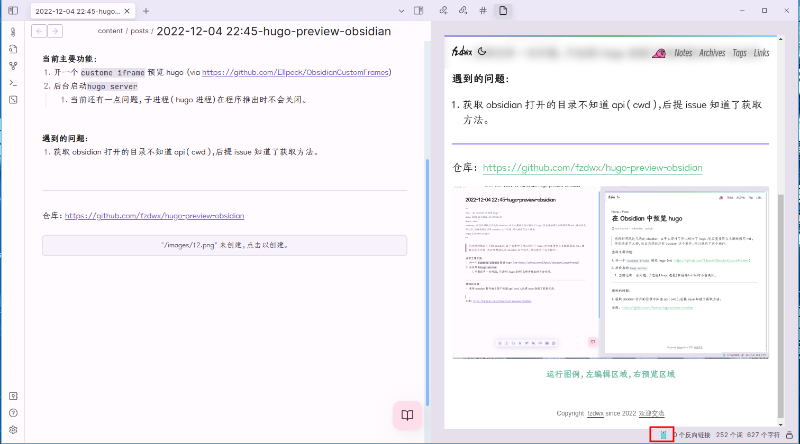

# hugo preview in obsidian

hugo preview int obsidian.

## Features

- [x] Open a `custome iframe` to preview hugo (via https://github.com/Ellpeck/ObsidianCustomFrames)
- [x] Start `hugo server` in the background
	- There is still a bit of a problem currently, the child process (hugo process) does not close when the program
	  launches.

## Install

```shell
git clone https://github.com/fzdwx/hugo-preview-obsidian /path/to/.obsidian/plugins/
```

## Use

Click on the gopher icon on the status bar


